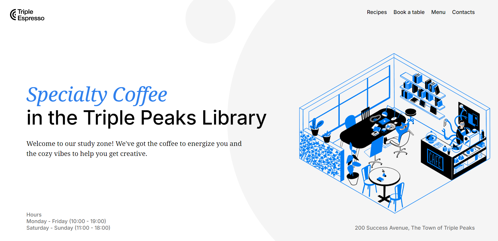
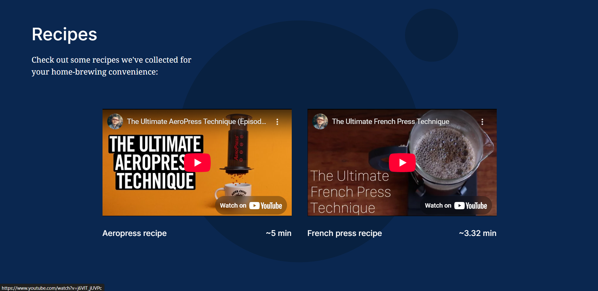
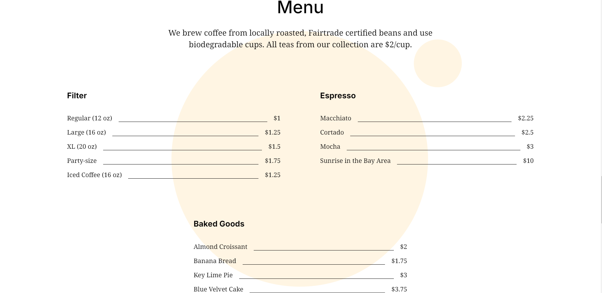
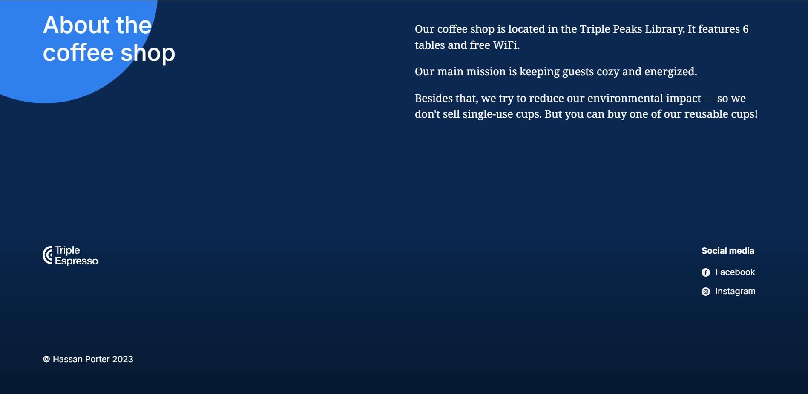

# Coffeeshop Landing Page

**A responsive multi-section static website built with semantic HTML and modular CSS.**

---

## Table of Contents

- [Overview](#overview)
- [Features](#features)
- [Tech Stack](#tech-stack)
- [Screenshots](#screenshots)
- [Demo Video](#demo-video)
- [Setup and Installation](#setup-and-installation)
- [Deployment](#deployment)
- [Contributing](#contributing)
- [Future Improvements](#future-improvements)
- [License](#license)
- [Acknowledgments](#acknowledgments)

---

## Overview

The **Coffeeshop** project is a clean and modern static website designed to promote a fictional coffee shop. It features multiple sections like an introduction, menu highlights, location info, and more. This project was built with accessibility, responsiveness, and best HTML/CSS practices in mind — making it a great representation of front-end layout and styling skills.

---

## Features

- Multi-section landing page (intro, mission, about, menu, etc.)
- Fully responsive layout for all devices
- Modular and reusable CSS styling using BEM methodology
- Smooth internal navigation
- Semantic HTML for accessibility

---

## Tech Stack

- HTML5
- CSS3
- BEM Methodology
- Git & GitHub

---

## Screenshots

  




---

## Demo Video

Watch a walkthrough of the project:  
👉 [Triple Peaks Library Demo Video](https://www.loom.com/share/2a52d27d92434ff883b41990d0bf8073)

## Setup and Installation

This project is static and **does not require npm, Node.js, or any server setup**.

1. Clone the repository

```bash
git clone https://github.com/GoReala23/se_project_coffeeshop.git
```

2. Navigate to the project folder

```bash
cd se_project_coffeeshop
```

3. Open `index.html` directly in your browser  
   or use the **Live Server** extension in VS Code for real-time preview.

---

## Deployment

This project is deployed using GitHub Pages.

Live demo: [Coffeeshop Landing Page](https://goreala23.github.io/se_project_coffeeshop/)

---

## Contributing

1. Fork the repository
2. Create your feature branch (`git checkout -b feature/YourFeature`)
3. Commit your changes (`git commit -m 'Add new feature'`)
4. Push to the branch (`git push origin feature/YourFeature`)
5. Open a pull request

---

## Future Improvements

- Add a contact form (non-functional or hooked to an API)
- Enhance animations and transitions
- Implement multi-language support

---

## License

This project is licensed under the MIT License.

---

## Acknowledgments

- TripleTen program curriculum
- Layout inspired by real-world coffee shop landing pages
